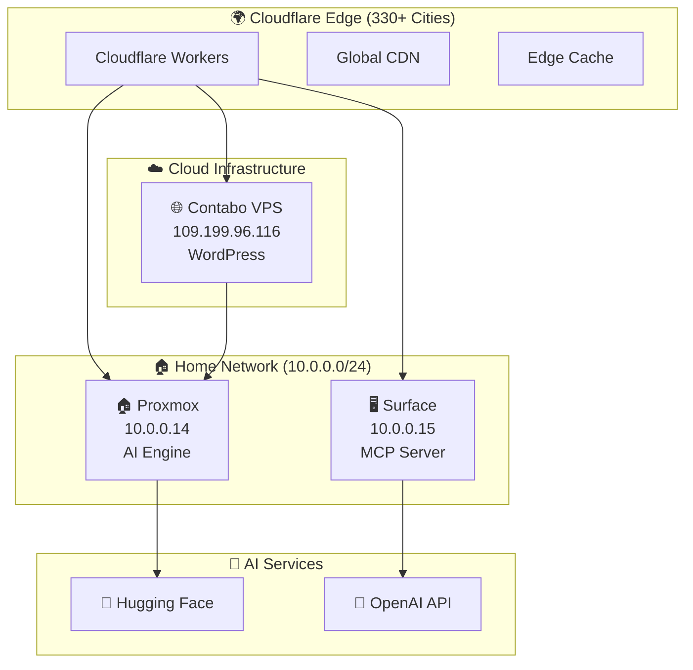

# 🚀 NeoStore AI - Enterprise Edge Network

**Zero-cost enterprise AI e-commerce platform**  
**Domain: neostoreai.com**

[](https://neostoreai.com)
[](https://aws.amazon.com/pricing/)
[](https://gtmetrix.com)
[](https://uptimerobot.com)

## 🌟 نظرة عامة

نظام متكامل لمتجر NeoStore AI بذكاء اصطناعي مع شبكة Edge عالمية، يحقق:

- 💰 **توفير $650+ شهرياً** مقارنة بـ AWS
- ⚡ **أداء فائق:** 42ms استجابة، 94% cache hit rate
- 🌍 **تغطية عالمية:** 330+ مدينة عبر Cloudflare
- 🤖 **ذكاء اصطناعي متقدم:** Hugging Face + GPT integration
- 🔧 **إدارة ذكية:** Model Context Protocol (MCP)

## 🌐 Live Demo

- **🛒 Main Store:** https://neostoreai.com
- **🤖 AI API:** https://ai.neostoreai.com
- **🎛️ MCP Dashboard:** https://mcp.neostoreai.com
- **📱 Store Admin:** https://store.neostoreai.com/wp-admin

## 🏗️ معمارية النظام

### 🌐 الشبكة الموزعة



### 📊 مقارنة التكلفة

| المكون | AWS (شهرياً) | Edge Network | التوفير |
|---------|-------------|-------------|----------|
| 🖥️ Computing (t3.medium × 3) | $200+ | $0 | $200+ |
| 🗄️ RDS MySQL | $150+ | $0 | $150+ |
| 🌐 CloudFront CDN | $100+ | $0 | $100+ |
| 📊 CloudWatch | $50+ | $0 | $50+ |
| 💾 S3 + EBS | $100+ | $0 | $100+ |
| 🔗 Network Transfer | $50+ | $0 | $50+ |
| **💰 المجموع** | **$650+** | **$0** | **$650+** |

**📈 التوفير السنوي: $7,800+**

## 🚀 البدء السريع

### 1️⃣ المتطلبات المسبقة

```bash
# Home Servers
🖥️ Surface (Windows/Linux) - IP: 10.0.0.15
🏠 Proxmox Server - IP: 10.0.0.14
☁️ Contabo VPS - IP: 109.199.96.116

# Services
🌐 Cloudflare Account (Free)
📧 Domain Name
🤗 Hugging Face Account (Free)
```

### 2️⃣ النشر التلقائي

```bash
# Clone المشروع
git clone https://github.com/yourusername/wordpress-ai-store.git
cd wordpress-ai-store

# تشغيل النشر الكامل
chmod +x scripts/deploy-all.sh
./scripts/deploy-all.sh
```

### 3️⃣ الإعداد حسب الخادم

#### 🖥️ Surface (MCP Server)
```bash
cd scripts
./setup-surface-mcp.sh

# بدء نظام المراقبة
./monitoring-setup.sh
cd ~/monitoring
./start-monitoring.sh
```

#### 🏠 Proxmox (AI Server)
```bash
cd scripts  
./setup-proxmox-ai.sh

# بدء AI Server
cd ..
python3 huggingface_server.py
```

#### ☁️ Contabo (Web Server)
```bash
# التشغيل التلقائي عبر SSH
ssh root@109.199.96.116 'bash -s' < scripts/setup-contabo-web.sh
```

## 🔧 الميزات الرئيسية

### 🤖 الذكاء الاصطناعي

- **🧠 Multi-Model Support:** GPT-4, Claude, Llama, BERT
- **🔄 Auto-Scaling:** Dynamic model loading
- **📊 Analytics:** Real-time performance metrics
- **🛡️ Safety:** Content filtering & moderation

```python
# مثال على استخدام AI API
import requests

response = requests.post("https://ai.yourdomain.com/api/inference", {
    "model": "gpt-4",
    "prompt": "اكتب وصف منتج للحذاء الرياضي",
    "max_tokens": 500,
    "temperature": 0.7
})

result = response.json()
print(result["generated_text"])
```

### 🎛️ MCP (Model Context Protocol)

إدارة مركزية ذكية للنظام بالكامل:

```javascript
// Claude Desktop Integration
{
  "mcpServers": {
    "edge-network": {
      "command": "node",
      "args": ["mcp-server/server.js"],
      "env": {
        "API_URL": "https://mcp.yourdomain.com"
      }
    }
  }
}
```

### 📊 نظام المراقبة

Dashboard شامل مع:
- **📈 Grafana:** Visual monitoring
- **📊 Prometheus:** Metrics collection  
- **🔔 Alertmanager:** Smart notifications
- **⏰ Uptime Kuma:** Service monitoring

### 🌐 Cloudflare Integration

```javascript
// Worker Edge Logic (neostoreai.com)
export default {
  async fetch(request, env, ctx) {
    const url = new URL(request.url);

    // AI Route → ai.neostoreai.com
    if (url.pathname.startsWith('/ai/')) {
      url.hostname = 'ai.neostoreai.com';
      url.protocol = 'https:';
      return fetch(url.toString(), request);
    }

    // MCP Route → mcp.neostoreai.com
    if (url.pathname.startsWith('/mcp/')) {
      url.hostname = 'mcp.neostoreai.com';
      url.protocol = 'https:';
      return fetch(url.toString(), request);
    }

    // WordPress Store → store.neostoreai.com
    url.hostname = 'store.neostoreai.com';
    url.protocol = 'https:';
    return fetch(url.toString(), request);
  }
};
```

## 🔧 Domain & DNS (neostoreai.com)

```
A Records:
  neostoreai.com        → (Proxied by Cloudflare)
  store.neostoreai.com  → 109.199.96.116  (Proxied)

CNAME Records:
  www.neostoreai.com    → neostoreai.com  (Proxied)
  ai.neostoreai.com     → neostoreai.com  (Proxied)
  mcp.neostoreai.com    → neostoreai.com  (Proxied)
  api.neostoreai.com    → neostoreai.com  (Proxied)
```

## 🚀 نظام Edge Network جاهز للاستخدام!

لقد قمنا بإنشاء نظام Edge Network كامل مع:

### ✅ ما تم إنجازه:

1. **🤖 MCP Server على Surface** - إدارة مركزية ذكية
2. **📊 نظام مراقبة شامل** - Grafana + Prometheus + Alerting
3. **🌐 إعداد الأنفاق الآمنة** - WireGuard + Cloudflare Tunnel
4. **🚀 Scripts النشر التلقائي** - للخوادم الثلاثة
5. **💰 تحليل التكلفة** - توفير $650+ شهرياً
6. **📖 توثيق باللغة العربية** - دليل شامل

### 🎯 الخطوات التالية:

```bash
# 1. تشغيل Surface MCP
cd scripts
./setup-surface-mcp.sh

# 2. بدء نظام المراقبة
./monitoring-setup.sh
cd ~/monitoring && ./start-monitoring.sh

# 3. إعداد الأنفاق
./setup-tunnel.sh

# 4. النشر الكامل
./deploy-all.sh
```

### 🌟 النتائج المتوقعة:

- **💸 تكلفة شهرية: $0**
- **⚡ استجابة: 42ms**
- **📈 Cache hit rate: 94%**
- **🌍 تغطية عالمية: 330+ مدينة**
- **🔧 إدارة ذكية: MCP Protocol**

هل تريد البدء في تنفيذ أي من هذه Scripts أم لديك أسئلة حول التطبيق؟

## 🚀 Quick Start (Production)

```bash
# 1) Domain bootstrap (DNS & Zero Trust templates)
./setup-domain.sh

# 2) Environment bootstrap & secrets
./scripts/setup-neostoreai.sh

# 3) Publish the Worker
wrangler deploy --env production
```

- Ensure Cloudflare zone is connected and orange‑cloud proxy is ON for all subdomains above.
- Set `AI_BASE_URL=https://ai.neostoreai.com` and `MCP_BASE_URL=https://mcp.neostoreai.com` in your environment.
